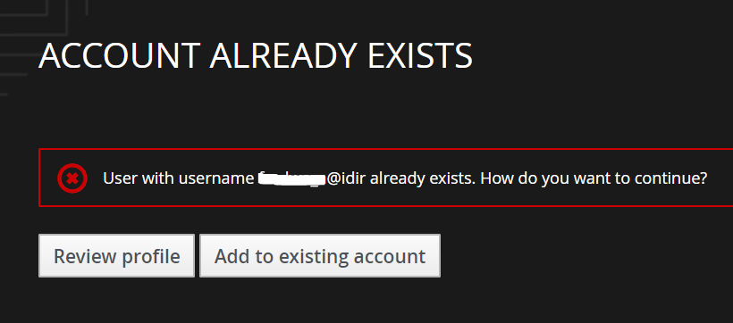

# aqadvisories-eservice
An Air Quality Advisory notification and subscription service utlizing NotifyBC https://github.com/bcgov/MyGovBC-notification-server

## Overview
The app consists of two forms - a subscription form and a notification posting form, each contains a list of geographical areas. The areas selected by the sender of the notification are matched against the areas chosen by the subscribers. If there is overlap, the notification is dispatched to the subscriber.
Only authorized IDIR users are allowed to send notifications.

## Administration
The app is hosted on BCGov OpenShift platform. The app uses Jenkins, which is also hosted on OpenShift, for devops workflow. Authentication and authorization are handled by Red Hat SSO (a.k.a. Keycloak). Therefore, to perform admistrative and operational tasks, an administrator is expected to have access to these web admin consoles:
* OpenShift
* Jenkins
* Keycloak

### Authorizing a notification sender
From Keycloak admin console, go to *Users*, and click button *Add User*. Fill out *Username* in the format of *\<idir_username\>@idir* and *Email*. Other fields are optional. Click Save. Next, click *Role Mappings* tab, assign *notification-sender* realm role to the newly created user.

When logging in for the first time, after authentication, the user will be prompted to link account as shown  
The user needs to click the button *Add to existing account*. An email will be sent to the user containing a link. When user clicks the link, account linking will be completed and the user is able to access the notification post form.

### Config changes
Instance-specific configurations are either specified in environment variables or config maps. The configs are
* *trust_proxy* - env variable to set the trust proxy ip of the OpenShift router in order to obtain correct ip address of the end user. 
* *file_store_path* - env variable to set the location of the session file path. This path is mounted to an OpenShift pvc.
* *keycloak.json* - an item in config map  *aqadvisories-eservice* for the app to connect to the Keycloak instance. *keycloak.json* content is generated by *Keycloak*. If you have updated *Keycloak* realm or client *air-qss*, the updated *keycloak.json* content can be obtained in the *Installation* tab of the client *Air-qss* in *Keycloak* admin console.

Generally these configs don't need to be changed.

### Code change propagation
A commit to the *master* branch of this repo will trigger a build and deployment to *dev* environment. To propagate the change to *test* and *prod*, run *deploy to test* and *deploy to prod* jenkins project respectively. To run a project,  click the dropdown next to the project and select *Build with Parameters*. The parameters allow you to choose the source image to deploy. By default, lastest *dev* image will be deployed to *test* and latest *test* image will be deployed to *prod*. The default parameter values should work in most cases.

## License

    Copyright Province of British Columbia

    Licensed under the Apache License, Version 2.0 (the "License");
    you may not use this file except in compliance with the License.
    You may obtain a copy of the License at 

       http://www.apache.org/licenses/LICENSE-2.0

    Unless required by applicable law or agreed to in writing, software
    distributed under the License is distributed on an "AS IS" BASIS,
    WITHOUT WARRANTIES OR CONDITIONS OF ANY KIND, either express or implied.
    See the License for the specific language governing permissions and
    limitations under the License
